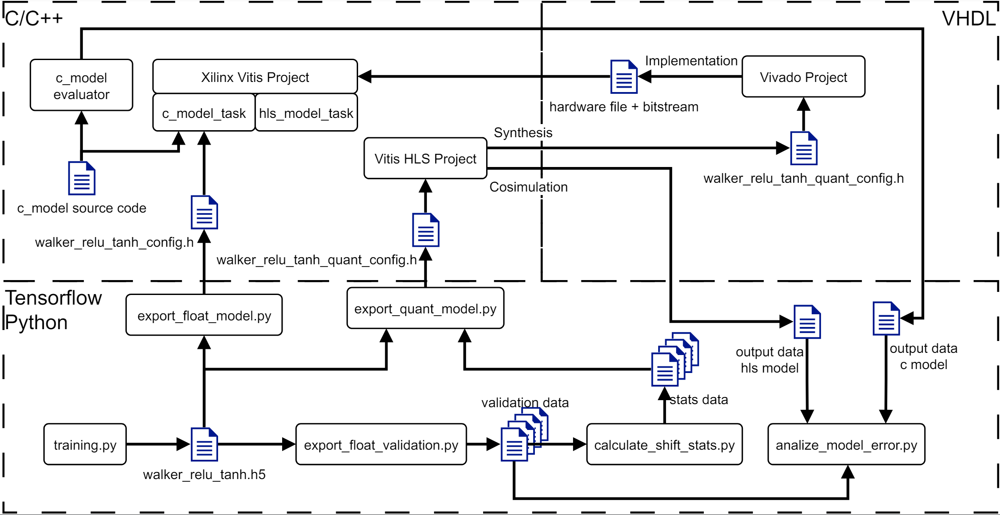
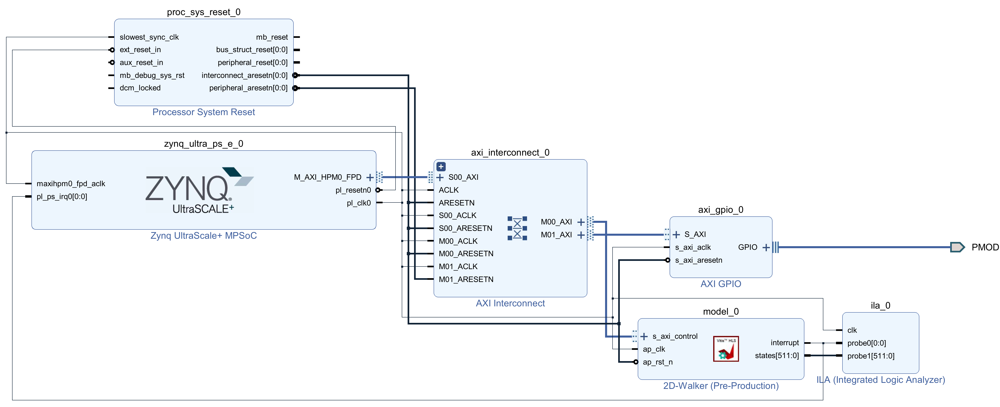

# Liquid Time Neural Networks on Embedded Devices
This repository implements the CfC network introduced by [Ramin Hasani et al](https://www.nature.com/articles/s42256-022-00556-7). A TensorFlow implementation from the [repository](https://github.com/raminmh/CfC) by Ramin Hasanit et al, has been used as a base for this repository. The training scripts from the CfC repository were adjusted for this project. This README contains a complete guide on how to get the implementation running on a Kria KV260 platform. Before the Deploy Pipeline can be executed the required projects must be set up, after which the step by step guid can be followed.

If only running both models on the Kria Platform is of interest, then the pipeline can be omited, because the required output files are already present in this repository. Thus, Section "Deploy Pipeline" can be skipped and only sections "Vitis Project" and "Run Application" must be followed.

## 1 Folder Structure
This readme file requires to specify folder and file locations, for which the variable WS is introduced. WS relates to the source folder, with which for example the readme location can be specified with WS/README.md.

## 2 Setup
### 2.1 Tools
- Python 3.9 or later
- TensorFlow 2.10.0 or later. (Since Tensorflow 2.14 keras.layers.AbstractRNNCell is not supported, which causes an error.)
- Vitis 2022.2
- Vitis HLS 2022.2
- Vivado 2022.2

### 2.2 Downloading the Dataset
The first thing is to download the training dataset, by calling the file donwload_dataset.sh in a bash console with
```bash
source download_dataset.sh
```
If errors occur or no bash console is available, download the dataset manually from [here](https://people.csail.mit.edu/mlechner/datasets/walker.zip) and unzip the zip file into WS/data/walker, such that the .npy files are located in folder WS/data/walker.

### 2.3 Vitis Project
Open Vitis with the workspace folder provided **WS/vitis/workspace**. Then import the vitis project archive zip **WS/vitis/vitis_export_archive.ide,zip**. Compiling it will result in an error, because the configuration file does currently not exist. As soon as the C model flow has been completed, the configuration file is available and thus this project is compilable.

### 2.4 Vitis HLS Project
Open Vitis HLS project located in directory **WS/vitis_hls/ltc_hls**. Then add a **new solution** for which the following settings must be set:
* Period = 300MHz
* Part/Board = Kria KV260 Vision AI Starter Kit SOM (xck26-sfvc784-2LV-c)
* Flow Target = Vivado IP Flow Target

### 2.5 Vivado Project
Start the Vivado application and open the project file located at **WS/vivado/ltc_acceleration.xpr**. The top file is a block diagram, that contains the 2D-Walker IP block.

### 2.6 Vitis HLS Cosimulation
The Cosimulation can check if the generated IP BLock behaves the same as the C Model. A problem with automising the test process, is that after each training session slightly different parameters are exported. This leads to small differences in the output with each newly exported configuration file. The behaviour can be checked regardless by using the outputs observed in the C Simulation report. They must be manually added to the testbench model_test.cpp. For that copy the observed output from the C Simulation report to the variable "expected" in the testbench model_test.cpp. Since both the C Model and the Comsimulation are fed with the same input, it is expected that both give the same results.

## 3 Deploy Pipeline
The image below visualises the deploy pipeline. There are two flows of which the first results in a C model running on a single core of the Cortex-A53. The second flow results in the model running on the FPGA as a memory mapped accelerator.



### 3.1 C Model Flow
1. Train the model using the script **WS/mdoel/training.py**, which trains and exports the model as an h5 file into the folder **WS/model/data/walker_relu_tanh_checkpoint**. This step is optional, because a pretrained h5 file is delivered in this workspace.
1. Generate the configuration file using the **WS/mdoel/export\_float\_model.py** script, which creates the file **WS/model/data/model\_export/walker\_relu\_tanh\_conifg.h**.
1. Open the Vitis project and compile the firmware without the hls\_model\_task, since it requires the quantised configuration file.

After setting up the solution the **C simulation** can be started. If it ran wihtout errors, then start the C Synthesis. When the synthesis completed successfully, then the IP Block can be exported using **Export RTL**. Export the IP Block into the folder **WS/ipBlock**. Unzip the exported zip folder at the same location.

### 3.2 FGPA Flow
1. Train the model using the script **WS/mdoel/training.py**, which trains and exports the model as an h5 file into the folder **WS/model/data/walker_relu_tanh_checkpoint**. This step is optional, because a pretrained h5 file is delivered in this workspace.
2. Export validation data using the script **WS/model/export\_float\_validation.py**, which exports text files, containing the inputs and outputs of all layers for 1937 different samples, into the folder **WS/model/data/walker_relu_tanh_checkpoint/float_validation**.
3. Create the statistics data files using the script **WS/model/calculate\_shift\_stats.py**. These files are exported to folder **WS/model/data/model_quant_export**.
4. Generate the quantised configuration file using the script **WS/model/export\_quant\_model.py**, which creates the file **WS/model/data/model_quant_export/walker\_relu\_tanh\_quant\_conifg.h**.
5. Open the Vitis HLS project and run C simulation to execute all tests. If they pass continue with next step, else resolve issue. Note that changes, which purposefully alter the output behaviour, fail the tests. This is resolved by adjusting the test scripts.
6. Start synthesis with void model(...) as the top function. After it is finished check the synthesis report. If it is satisfactory then continue with next step, else optimise implementation.
7. **(Optional)**: If a the IP Block's behaviour must be tested, then follow the instructions of section **Vitis HLS Cosimulation** to set up the Cosimulation correctly. After which the Cosimulation can be executed and if the simulation passes then continue with the next step else resolve issue.
8. Export RTL as Vivado IP (.zip) to the folder **WS/ipBlock**. Unzip the exported file into the same folder.  Vitis \acrshort{hls} can be closed now.
9. Open the Vivado project and open the block diagram. In the block diagram replace 2D-Walker IP Block with your newly exported IP. For that make sure that the folder **WS/ipBlock** is added to the IP Catalogue. 
10. Connect the IP block and alter the clock provided by the processing system if necessary.
11. This should result in a block diagram similar to the following one:
    
12. Run synthesis and implementation. Check the implementation results afterwards, if no timing issues are present, then continue with the next step.
13. Generate and export hardware including the bit stream to folder **WS/Vivado**. Vivado can now be closed.
14. Open the Vitis project and update hardware specification with the newly exported file from the step before.
15. It is recommeded to clean the project.
16. Compile the platform and the application.
  
## 4 Run Application
1. Connect PC with Kria via JTAG programmer.
2. Connect PC with Kria via USB-2 Micro (J4) for serial communication using the UART interface of the Kria.
3. Power up the Kria Platform.
4. Manually override bootmode to JTAG bootmode, since the Platform is per default in SD card bootmode. This can be done by typing the following commands into the XSCT console, while the Platform is connected via JTAG. More info about this is found [here](https://xilinx.github.io/kria-apps-docs/creating_applications/2022.1/build/html/docs/bootmodes.html).
   1. connect
   2. targets -set -filter {name=~ "PSU"}
   2. mwr 0xffca0010 0x0
   3. mwr 0xff5e0200 0x0100
   4. rst -system
5. Use a serial terminal of your choice and connect to the virtual serial port of the Kria Platform. Note that two ports will be visible and the UART is the Com Port with the lower number. The Parameters are:
    * Baud Rate: 115200
    * Data Bits: 8
    * Stop Bits: 1
    * Parity: None
    * Flow Control: None
6. If the the program has not been compiled yet, then recompile the project. (A complete clean on your first set up is recommended)
7. Program the device using the JTAG debugger. Sometimes the programming fails, after which a retry usualy solves the problem.
8. After programming the program will halt at the first line of the main function. Place a breakpoint at **line 120** in the src file **hls_model_task.c**.
9. Continue the program. The program will first execute the C-Model after which its outputs and execution time is reported on the serial port. After sending the report the C-Model starts the HLS-Model which also reports its output and execution time. It will continue with the C-Model and infinitely loop through both models.

## 5 PMOD Connector (J2)
The PMOD connector was used for more accurate time measurements. Currently pin 1 is set to high when either the C-Model or the HLS-Model starts its execution. The pin is set to low if either of them finished its execution. The program is set up that it starts with executing the C-Model. The time can be measured by measuring the pulse width of pin 1 with for example an oscilloscope.


